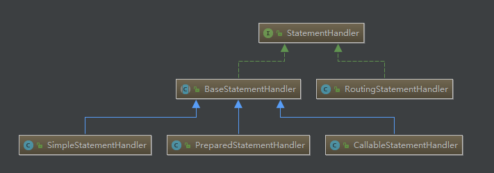

### Mybatis执行器 Executor

https://blog.csdn.net/cleargreen/article/details/80614362
如上图，Executor主要分为两大类 BaseExecutor 和 CachingExecutor
#### BaseExecutor 
抽象父类，定义了一些抽象方法和模板方法
##### SimpleExecutor
简单执行器，每执行一次update和query就创建一个statement，用完就关闭
##### ReuseExecutor
可重复使用statement的executor，与simple不同的是，它会把执行过的statement放到一个statementMap中,如果在statementMap中存在，就不用再创建新的statement
##### BatchExecutor
批量执行器，只有在update才使用，query不支持批量查询
##### ClosedExecutor
ResultLoader下面的一个私有内部类，实现方法中，直接抛出异常
#### CachingExecutor
在CachingExecutor中，有一个Executor delegate，在查询的时候，先从缓存中查找，如果缓存中没有的话，在到委托的delegate的Executor中query方法，查询结果，放入缓存中，delegate executor可以是上面的任意一种,在执行update之后会更新flush缓存
```java
public class CachingExecutor implements Executor {
    //...
public <E> List<E> query(MappedStatement ms, Object parameterObject, RowBounds rowBounds, ResultHandler resultHandler, CacheKey key, BoundSql boundSql)
      throws SQLException {
    Cache cache = ms.getCache();
    if (cache != null) {
      flushCacheIfRequired(ms);
      if (ms.isUseCache() && resultHandler == null) {
        ensureNoOutParams(ms, boundSql);
        @SuppressWarnings("unchecked")
        List<E> list = (List<E>) tcm.getObject(cache, key);
        if (list == null) {
          list = delegate.<E> query(ms, parameterObject, rowBounds, resultHandler, key, boundSql);
          tcm.putObject(cache, key, list); // issue #578 and #116
        }
        return list;
      }
    }
    return delegate.<E> query(ms, parameterObject, rowBounds, resultHandler, key, boundSql);
  }
  //...
}

```


> 在Executor中有doQueryCursor,这是用来进行流操作的，看简单操作

```java
Cursor<User> users = sqlSession.selectCursor("getUserCursor");
// iterator on users
Iterator<User> iter = users.iterator();
List<User> userList = new ArrayList(100)
while (iter.hasNext()) {
    // 每达到100条进行处理
    for(int i = 0; i<100 && iter.hasNext(); i++) {
        userList.add(iter.next());
    }
    export2Excel(userList);//导出100条到excel
    userList.clear();
}
```
我们看下Cursor的实现类DefaultCursor，在DefaultCursor中有一个CursorIterator内部类，实现Iterator接口，当调用next方法时， 执行fetchNextUsingRowBound
如下:
```java
public class DefaultCursor<T> implements Cursor<T> {
    //...
    protected T fetchNextUsingRowBound() {
        T result = fetchNextObjectFromDatabase();
        while (result != null && indexWithRowBound < rowBounds.getOffset()) {
            result = fetchNextObjectFromDatabase();
        }
        return result;
    }

    protected T fetchNextObjectFromDatabase() {
        if (isClosed()) {
            return null;
        }

        try {
            status = CursorStatus.OPEN;
            resultSetHandler.handleRowValues(rsw, resultMap, objectWrapperResultHandler, RowBounds.DEFAULT, null);
        } catch (SQLException e) {
            throw new RuntimeException(e);
        }

        T next = objectWrapperResultHandler.result;
        if (next != null) {
            indexWithRowBound++;
        }
        // No more object or limit reached
        if (next == null || getReadItemsCount() == rowBounds.getOffset() + rowBounds.getLimit()) {
            close();
            status = CursorStatus.CONSUMED;
        }
        objectWrapperResultHandler.result = null;

        return next;
    }
    //...
}
```
主要是在进行大批量数据的加载处理的时候，如果执行sql统一返回大量数据，容易造成OOM，通过cursor我们可以一条一条加载出来，或者每10条、每100条数据来进行处理，避免OOM

### StatementHandler

StatementHandler在Mybatis中至关重要，主要有StatementHandler的子类进行与数据库交互，如上图，主要包括5个子类
#### BaseStatementHandler 
定义了一些公共方法，要子类去实现下面方法去实例化Statement 

> protected abstract Statement instantiateStatement(Connection connection)

实例化后，要子类去实现自己的update和query方法与数据库进行交互
- SimpleStatementHandler 简单处理器

- PreparedStatementHandler 预编译处理器

- CallableStatementHandler 处理存储过程的处理

####RoutingStatementHandler
这个类里面声明了一个delegate StatementHandler,所有操作都是委托给delegate，看下代码
```java
public class RoutingStatementHandler implements StatementHandler {

//....
  private final StatementHandler delegate;

  public RoutingStatementHandler(Executor executor, MappedStatement ms, Object parameter, RowBounds rowBounds, ResultHandler resultHandler, BoundSql boundSql) {

    switch (ms.getStatementType()) {
      case STATEMENT:
        delegate = new SimpleStatementHandler(executor, ms, parameter, rowBounds, resultHandler, boundSql);
        break;
      case PREPARED:
        delegate = new PreparedStatementHandler(executor, ms, parameter, rowBounds, resultHandler, boundSql);
        break;
      case CALLABLE:
        delegate = new CallableStatementHandler(executor, ms, parameter, rowBounds, resultHandler, boundSql);
        break;
      default:
        throw new ExecutorException("Unknown statement type: " + ms.getStatementType());
    }

  }
//....  
}
```
也就是说，我们通过这个类来路由到其他BaseStatementHandler的三个子类，看下在Configuration中怎么创建的StatementHandler
```java
public class Configuration {
  //...
  public StatementHandler newStatementHandler(Executor executor, MappedStatement mappedStatement, Object parameterObject, RowBounds rowBounds, ResultHandler resultHandler, BoundSql boundSql) {
    StatementHandler statementHandler = new RoutingStatementHandler(executor, mappedStatement, parameterObject, rowBounds, resultHandler, boundSql);
    statementHandler = (StatementHandler) interceptorChain.pluginAll(statementHandler);//插件
    return statementHandler;
  }
  //...
}

```
在上面说的Executor中，在调用Executor中的doUpdate和doQuery的时候都会创建一个StatementHandler，用SimpleExecutor来说明
```java
public class SimpleExecutor extends BaseExecutor {

//...
  public <E> List<E> doQuery(MappedStatement ms, Object parameter, RowBounds rowBounds, ResultHandler resultHandler, BoundSql boundSql) throws SQLException {
    Statement stmt = null;
    try {
      Configuration configuration = ms.getConfiguration();
      StatementHandler handler = configuration.newStatementHandler(wrapper, ms, parameter, rowBounds, resultHandler, boundSql);
      stmt = prepareStatement(handler, ms.getStatementLog());
      return handler.<E>query(stmt, resultHandler);
    } finally {
      closeStatement(stmt);
    }
  }
}  
```
这样是不是就穿起来了呢，后面还有ResultHandler，对结果进行处理，这个后面会提到

### 参数处理器 ParameterHandler 和 结果处理 ResultHandler (ResultSetHandler)

这两个就放在一起讲了，ParameterHandler一个实现类DefaultParameterHandler,主要通过setParameters方法进行参数设置
只有在CallableStatementHandler和PreparedStatementHandler的parameterize方法中调用setParameters方法进行设置参数
SimpleStatementHandler是简单的查询，没有参数设置。

ResultSetHandler

####

### 缓存Cache
https://www.cnblogs.com/xdp-gacl/p/4270403.html
FifoCache
linkedList 存放key 每put一次，检查一次