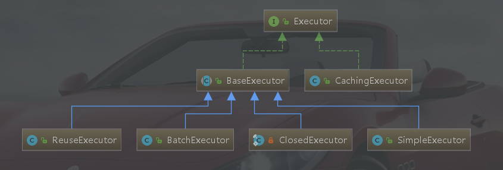

## Mybatis执行器和缓存
Executor 和 Cache 在mybatis中有着重要的作用，通过Executor才能执行相应的sql操作，这里会说到流式查询selectCursor。
Cache能够给我们提供本地缓存个的功能提升效率，但是有关Cache还是有一些要注意的点，后面会说道。

### Executor

https://blog.csdn.net/cleargreen/article/details/80614362
如上图，Executor分为两大类
Base

### Cache
https://www.cnblogs.com/xdp-gacl/p/4270403.html
FifoCache
linkedList 存放key 每put一次，检查一次