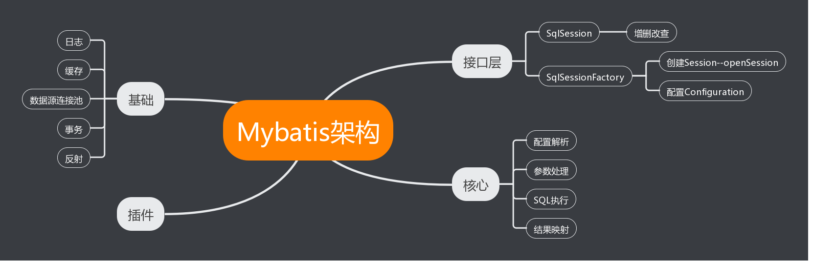

##Mybatis

> MyBatis 是一款优秀的持久层框架，它支持定制化 SQL、存储过程以及高级映射。MyBatis 避免了几乎所有的 
JDBC 代码和手动设置参数以及获取结果集。MyBatis 可以使用简单的 XML 或注解来配置和映射原生信息，将接口
和 Java 的 POJOs(Plain Old Java Objects,普通的 Java对象)映射成数据库中的记录。 -- 官网

###整体架构

通过上图可以对Mybatis的架构有一个大概的了解，我们从程序启动加载xml相关配置，到执行操作返回数据的路线，来进行流程梳理及源码解析，大致分为以下几个流程
- 配置信息初始化
- 接受调用创建会话
- 处理请求
- 返回处理结果

####配置信息初始化
在Mybatis中，SqlSessionFactory 和 SqlSession 有着重要的作用，SqlSessionFactory为我们生成SqlSession，通过SqlSession我们可以进行增删改查等操作
在SqlSessionFactory中，声明了Configuration类，此类包含了大量的配置基础信息，我们在项目中配置的mybatis-config.xml就是配置的Configuration类的内容
例如Environment -> DataSource ,mapper.xml文件等，在不继承Spring相关的东西，单纯使用Mybatis进行数据操作,首先要配置的就是Configuration类的相关信息
如下：config.xml

```xml
<?xml version="1.0" encoding="UTF-8"?>
<!DOCTYPE configuration
        PUBLIC "-//mybatis.org//DTD Config 3.0//EN"
        "http://mybatis.org/dtd/mybatis-3-config.dtd">
<configuration>
    <environments default="dev">
        <environment id="dev">
            <!-- 配置事务管理 ，采用JDBC管理事务-->
            <transactionManager type="JDBC"/>
            <!-- POOLED是mybatis的 数据源 -->
            <!-- JNDI是基于tomcat的数据源 -->
            <dataSource type="POOLED">
                <property name="driver" value="com.mysql.jdbc.Driver"/>
                <property name="url" value="jdbc:mysql://xxxx:3306/test"/>
                <property name="username" value="xxx"/>
                <property name="password" value="xxxxxx"/>
            </dataSource>
        </environment>
    </environments>
    <!-- pojo的映射文件UserMapper引入到配入到配置文件中 -->
    <mappers>
        <mapper resource="com.learning.mapping/UserMapper.xml"/>
    </mappers>
</configuration>
```
也可以通过<settings>标签来设置Configuration的相关属性
```xml
    <settings>
        <setting name="logImpl" value="LOG4J"/>
    </settings>
```

config.xml文件的解析是通过org.ibatis.builder.xml.XMLConfigBuilder来进行解析的

local cache 默认session缓存，事务问题
https://segmentfault.com/a/1190000008207977

mybitas 插件
1 implements Interceptor
2 @Intercepts(
      {
          @Signature(type = Executor.class, method = "query", args = {MappedStatement.class, Object.class, RowBounds.class, ResultHandler.class}),
          @Signature(type = Executor.class, method = "query", args = {MappedStatement.class, Object.class, RowBounds.class, ResultHandler.class, CacheKey.class, BoundSql.class}),
      }
  )
3  @Override public Object intercept(Invocation invocation){}
4 @Override public Object plugin(Object target) { return Plugin.wrap(target, this); }
5 sqlSessionFactory.getConfiguration().addInterceptor(interceptor);

ResultHandler
1 implements ResultHandler
2 @Override public void handleResult(ResultContext<? extends V> context) 